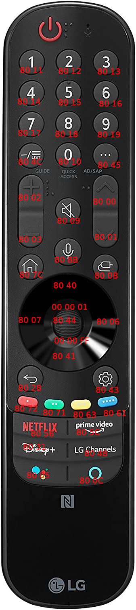

# lg_magic_ble
Discoveries reverses engineering the BLE HID descriptors

HID raw stream breaks up in 20 byte segments

## Updated findings

I'm breaking this into decimal so it's easier to parse.

The only motion data that is consistent is the 12th byte. I can twist the remote in my hand and get a flat value of 0 and ~240 left 90 degress and 15 right 90 degress.

The reset seems like raw acceleromter data.

```
253       Constant
214       Unknown (range of about 180 to 220)
49        Counter (00 to FF incremenmnts every message
253       Constant
0         Constant
255       Motion
237       Motion 
255       Motion
248       Motion
255       Motion
255       Motion
0         Motion (Roll along X axis)
32        Motion 
254       Motion
107       Motion
240       Motion
45        Motion
0         Is button pressed (0 or 128)
0         Button code
0         Scrollwheel (Up 1, Down 255)
```

## Intiial findings

```
FD                DCB6FDFFFFEFFFFAFFFE0028FE65F027        00   00     00
Constant          Gyro fuckery                            Buttons     Scrollwheel
```

Hex mapping for the MR21 remote


